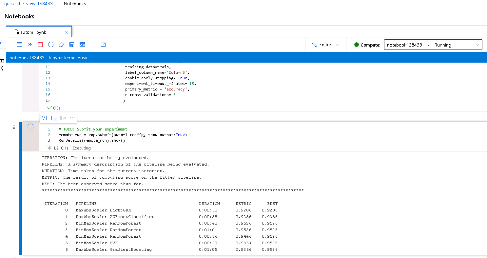
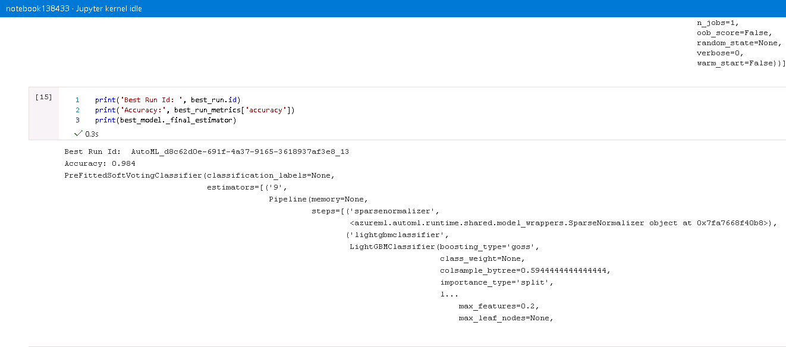
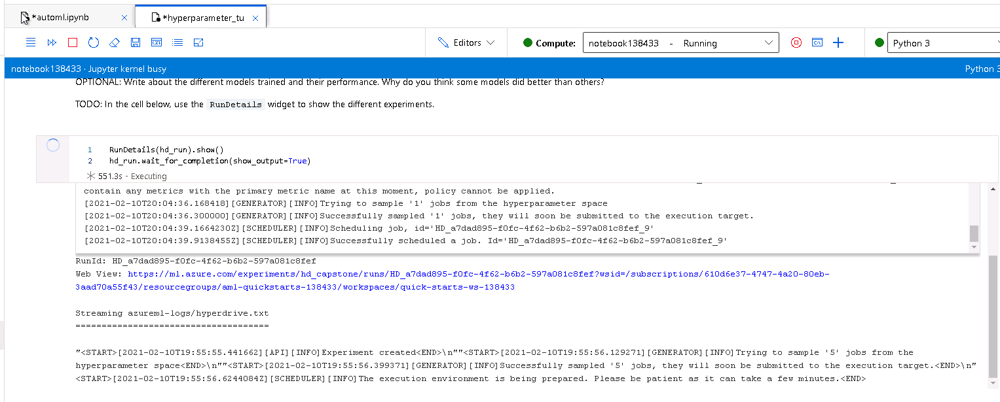
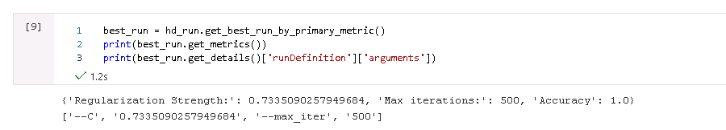
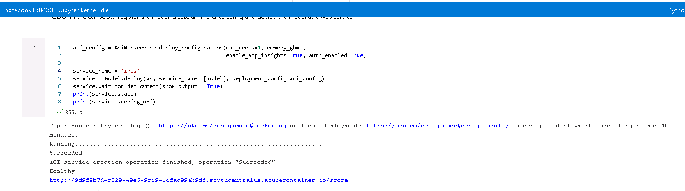
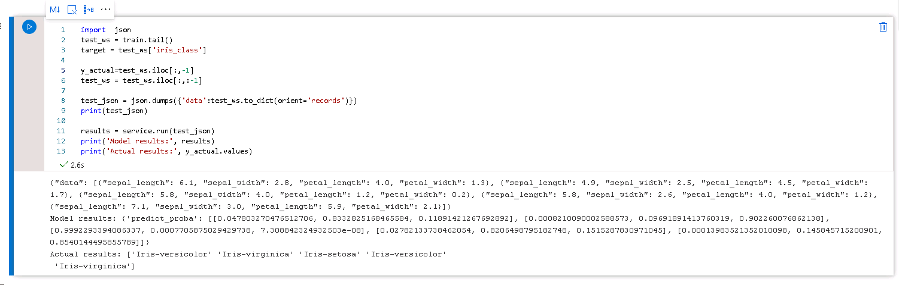
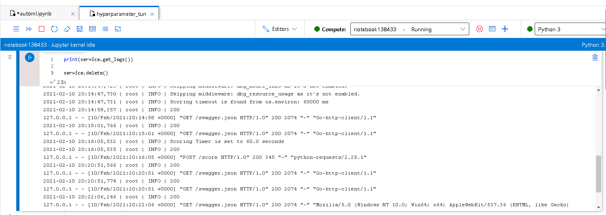

# Capstone project

This project shows usage of AutoML and Hyperdrive, two methods available at Azure Machine Learining, to create, train, deploy and consume classification model for Iris dataset. 

## Dataset

### Overview
Dataset that is used is Iris dataset. It is freely available at UCI machine learining repository. It contains 150 observations of iris species - 3 classes of 50 observations. There are four features - sepal length, sepal width, petal length and petal width. Features will be used to predict class of iris.

### Task
Task of experiment is to correctly predict class of iris flower based on four features - sepal length, sepal width, petal length and petal width. Dataset is explored in 'automl.ipynb' notebook.

### Access
Data is freely available in UCI machine learning repository. Dataset link is passed to the Dataset.Tabular.from_delimited_files method.

## Automated ML
1. AutoML object was initialized with "classification" task with metric "accuracy". 
2. experiment_timeout_minutes - maximum amount of time in minutes that all iterations combined can take before the experiment terminates. Iti is set to 15.
3. n_cross_validations - how many cross validations to perform when user validation data is not specified. It is set to 5 as dataset is not large and it gives reasonable bias/variance tradeoff.
4. enable_early_stopping - whether to enable early termination if the score is not improving in the short term.
### Results
Fourteen models were trained before experiment terminated. Best model was VotingEnsemble with accuracy 98.40%.

Ensemble models combine predictions of several base models in order to improve generalizability / robustness over a single estimator. In case of best model, voting classifier used soft vote method ('prefittedsoftvotingclassifier') which averages predicted probabilities (soft vote) to predict the class labels. Model used 9 estimators, with hyperparameters like min_impurity_decrease=0.0, min_impurity_split=None, min_samples_leaf=0.01, min_samples_split=0.01,min_weight_fraction_leaf=0.0 which indicates on tree based models. Ensemble models are trained as final iterations of AutoML runs.

Below is screenshots of the `RunDetails` widget with several trained models:

Best model:

## Hyperparameter Tuning
As the task was classification between three classes, Logistic Regression model was chosen. Model was trained with hyperparameters tuned with HyperDrive. Hyperdrive optimized accuracy as primary metric, by maximizing it. Optimized parameters were: C - inverse of regularization strength and parmater max_iter - maximum number of iterations taken for the solver to converge.

Parmeters C and max_iter were sampled randomly using RandomParameterSampling sampler. The C values were chosen from continous range (`uniform(0.1, 0.9)`) of uniform distribution and the max_iter was chosen from discrete set of values (`choice(10, 50, 100, 250,  500)`). In random search, each hyperparameter combination from defined range has equal probability of being selected, what results in computational efficiency of the tuning proces, saving time and resources, unlike in grid search where whole range is searched exhaustively. Random search is commonly used method during hyperparematers tuning, as it results with smilary good results as grid search, but in much shorter time.

Additional early stopping Bandit policy was used. The policy helps to optimize time and resources by terminating runs that does not fall within the slack factor or slack amount of the evaluation metric with respect to the best performing run.

### Results
Model resulted with accuracy 100% with regularization strength (parameter C) equal to 0.733(...) and max iterations (parameter max_iter) eqaul to 500. Results of best model and RunDetails widget are shown below.

Below is screenshots of the `RunDetails` widget as training progresses:

Best model:

## Model Deployment
Enpoint webservice was deployed using Azure ACI. Specific commands are shown on screenshot below:

After endpoint showed as healthy, five samples from test dataset were taken and converted and dumped as JSON files. JSON is then sent to webservice and scoring results are obtained. This way endpoint is queried and tested with sample data:

After finishing works endpoint was deleted:

## Improvements
Hypedrive model resulted in accuracy equal to 1. AutoML models performed worse. To improve it, AutoML can be run for longer, resulting in higher number of iterations and possibly even better models. Additionaly optimized metrics can be changed to AUC, precision, recall or F1 score. 

## Screen Recording
https://youtu.be/U0W6VEcWLz0

